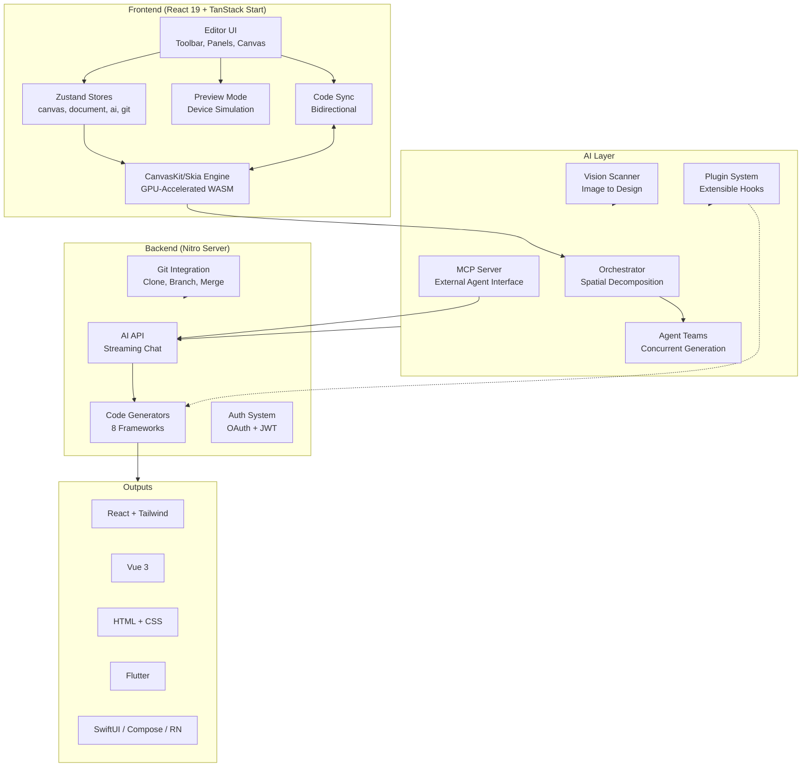
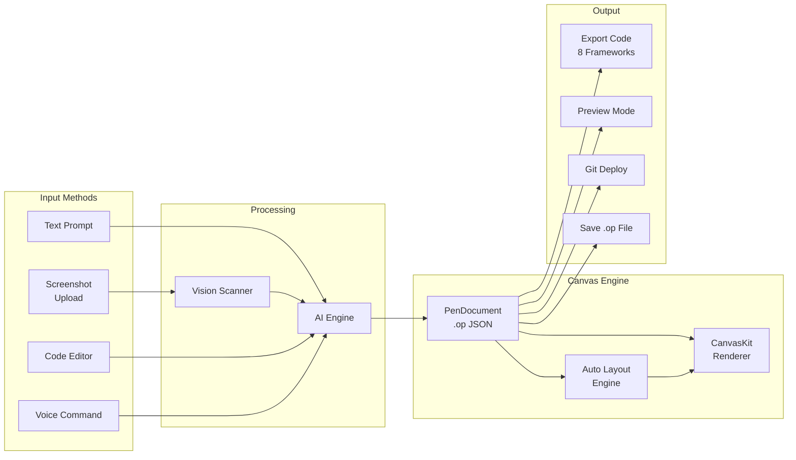
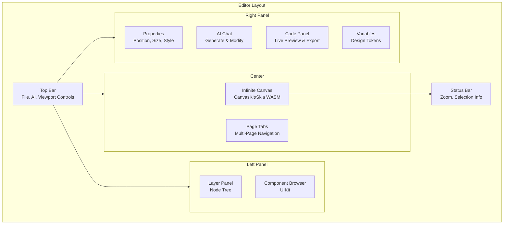
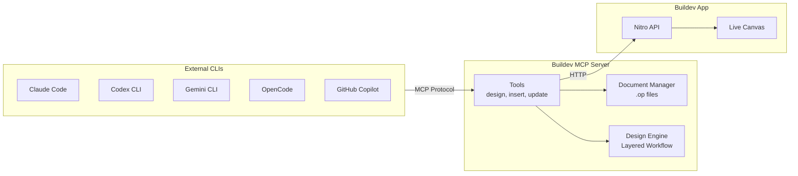
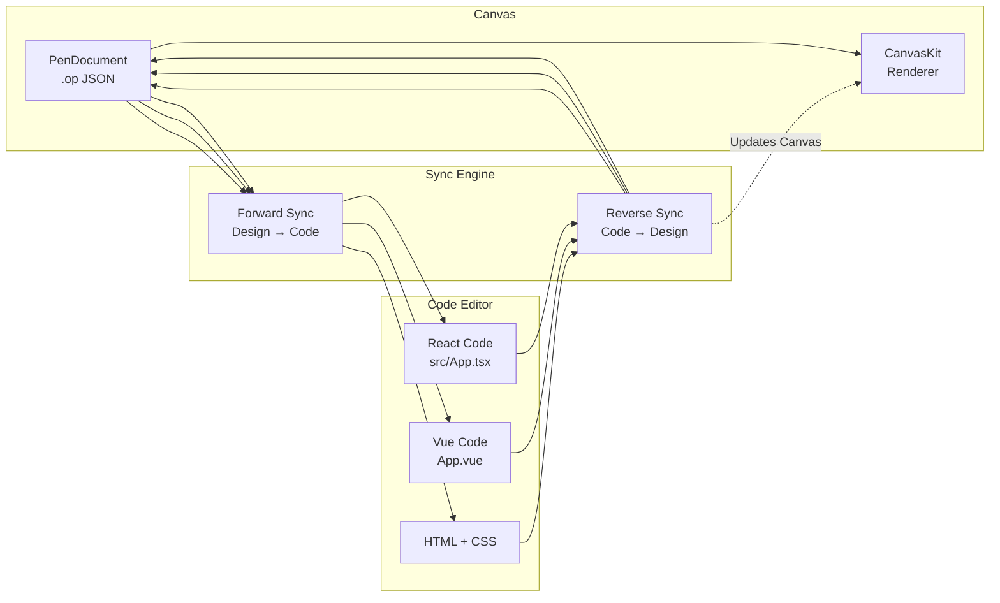
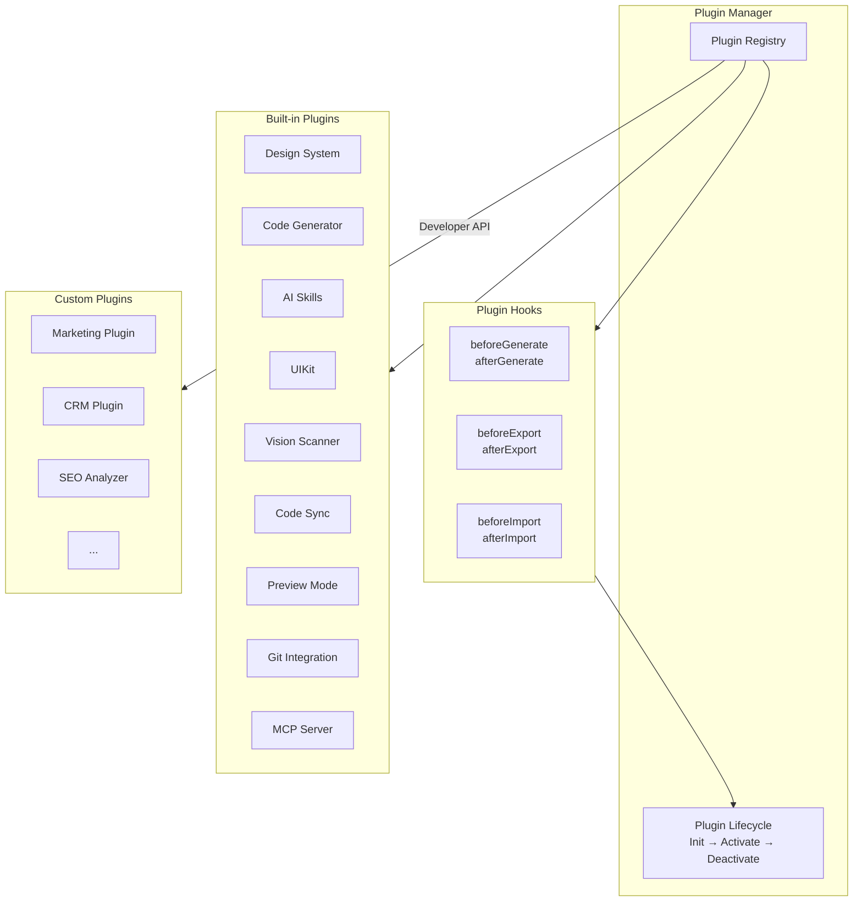
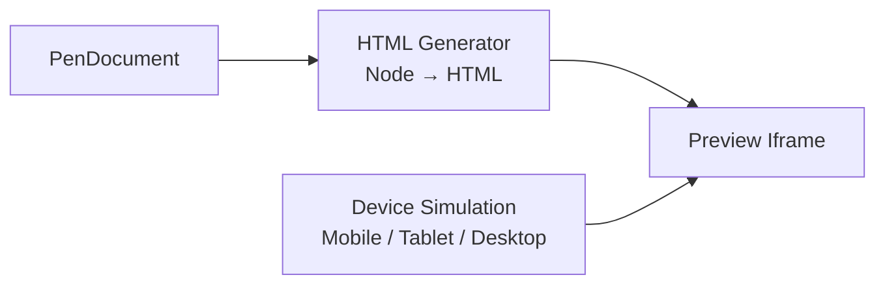

<p align="center">
  
</p>

<h1 align="center">Buildev</h1>

<p align="center">
  <strong>The world's first open-source AI-native vector design tool.</strong><br />
  <sub>Concurrent Agent Teams &bull; Design-as-Code &bull; Built-in MCP Server &bull; Multi-model Intelligence</sub>
</p>

<p align="center">
  <a href="https://github.com/bryfar/Buildev-oficial/stargazers"></a>
  <a href="https://github.com/bryfar/Buildev-oficial/blob/main/LICENSE"></a>
  <a href="https://github.com/bryfar/Buildev-oficial/actions/workflows/ci.yml"></a>
  <a href="https://discord.gg/h9Fmyy6pVh"></a>
</p>

<br />

---

## Architecture Overview

Buildev is a **Design-as-Code** platform. Unlike traditional design tools that export static images, every design is a living `.op` JSON document that can be version-controlled, AI-generated, and exported to production code.



---

## How the IDE Works



The IDE has three main panels:



---

## Features

### 🎨 Prompt → Canvas

Describe any UI in natural language. Watch it appear on the infinite canvas in real-time with streaming animation. Modify existing designs by selecting elements and chatting.


### 🤖 Concurrent Agent Teams

The orchestrator decomposes complex pages into spatial sub-tasks. Multiple AI agents work on different sections simultaneously — hero, features, footer — all streaming in parallel with per-member canvas indicators.

```mermaid
flowchart LR
    User[User Prompt<br/>"Landing page for SaaS"]
    Orchestrator[Orchestrator<br/>Spatial Decomposition]
    
    subgraph Agents["Agent Teams"]
        A1[Agent 1<br/>Hero Section]
        A2[Agent 2<br/>Features Grid]
        A3[Agent 3<br/>Footer]
        A4[Agent N<br/>...]
    end
    
    Canvas[Canvas<br/>Real-time Streaming]

    User --> Orchestrator
    Orchestrator --> A1
    Orchestrator --> A2
    Orchestrator --> A3
    Orchestrator --> A4
    A1 --> Canvas
    A2 --> Canvas
    A3 --> Canvas
    A4 --> Canvas
```

### ✨ AI Vision Scanner

Drop a screenshot or mockup and convert it into editable PenNode AST nodes instantly.

```mermaid
flowchart LR
    Upload[Upload<br/>Screenshot/PNG/JPG]
    AI[Vision AI<br/>Claude/GPT-4o]
    Parser[JSON Parser<br/>→ PenNode AST]
    Canvas[Canvas<br/>Editable Design]

    Upload -->|base64 image| AI
    AI -->|structured JSON| Parser
    Parser -->|PenNode[]| Canvas
```

- **File:** `apps/web/src/services/ai/vision-scanner.ts`
- Accepts image data via AI chat attachments
- Returns structured `PenNode[]` with positions, sizes, colors, and text
- Supports context hints for better accuracy

### 🧠 Multi-Model Intelligence

Automatically adapts to each model's capabilities. Claude gets full prompts with thinking; GPT-4o/Gemini disable thinking; smaller models (MiniMax, Qwen, Llama) get simplified prompts for reliable output.

| Agent | Setup |
|-------|-------|
| **Built-in (9+ providers)** | Select from provider presets with region switcher |
| **Claude Code** | No config — uses Claude Agent SDK with local OAuth |
| **Codex CLI** | Connect in Agent Settings (`Cmd+,`) |
| **OpenCode** | Connect in Agent Settings (`Cmd+,`) |
| **GitHub Copilot** | `copilot login` then connect in Agent Settings |
| **Gemini CLI** | Connect in Agent Settings (`Cmd+,`) |

### 🔌 MCP Server

One-click install into Claude Code, Codex, Gemini, OpenCode, Kiro, or Copilot CLIs. Design from your terminal.



### 🔁 Code Mode Autosync

Edit generated code and sync changes back to the visual canvas bidirectionally.



- **Reverse parsers:** React, Vue 3, HTML, generic
- **Sync state:** dirty/clean tracking per file
- **Conflict detection:** warns on simultaneous edits

### 🎨 Style Guides

Built-in style guide library with tag-based fuzzy matching. Apply visual styles (glassmorphism, brutalist, retro, etc.) to AI-generated designs.

### 📦 Design-as-Code

`.op` files are JSON — human-readable, Git-friendly, diffable. Design variables generate CSS custom properties.

### 🧩 Plugin System

Extensible plugin architecture built on top of the AI Skills engine.



- **9 built-in plugins** pre-installed
- **Phase hooks:** before/after generate, export, import
- **Capability system:** plugins advertise what they offer
- **Store:** `apps/web/src/stores/plugin-store.ts`
- **Engine:** `packages/pen-ai-skills/src/plugin-system.ts`

### 🖥️ Preview Mode

Dedicated device preview for responsive testing.



- **Devices:** Mobile (375px), Tablet (768px), Desktop (1280px)
- **Features:** Fullscreen, Auto-scale, Refresh
- **File:** `apps/web/src/components/editor/preview-mode.tsx`

### 🖥️ Runs Everywhere

Web app + native desktop on macOS, Windows, and Linux via Electron. Auto-updates from GitHub Releases.

### ⌨️ CLI — `op`

```bash
npm install -g @bryfar/buildev

op start                     # Launch desktop app
op design @landing.txt       # Batch design from file
op insert '{"type":"RECT"}'  # Insert a node
op import:figma design.fig   # Import Figma file
cat design.dsl | op design - # Pipe from stdin
```

### 🎯 Multi-Platform Code Export

8 frameworks from one design:
- React + Tailwind CSS | HTML + CSS | CSS Variables
- Vue 3 | Svelte | Flutter | SwiftUI | Jetpack Compose | React Native

---

## Quick Start (Development)

```bash
# Prerequisites
bun install

# Start dev server at http://localhost:3000
bun --bun run dev

# Or run as desktop app
bun run electron:dev
```

> **Prerequisites:** [Bun](https://bun.sh/) >= 1.0 and [Node.js](https://nodejs.org/) >= 18.

---

## Project Structure

```text
openpencil/
├── apps/
│   ├── web/                    TanStack Start web app
│   │   ├── src/
│   │   │   ├── canvas/         CanvasKit/Skia engine
│   │   │   ├── components/     React UI — editor, panels, dialogs
│   │   │   ├── services/
│   │   │   │   ├── ai/         AI chat, orchestrator, vision scanner
│   │   │   │   ├── codegen/    Code generation wrappers
│   │   │   │   └── code-parsers/  React/Vue/HTML parsers (reverse sync)
│   │   │   ├── stores/         Zustand — canvas, document, plugin, code-sync
│   │   │   ├── uikit/          Reusable component kit system
│   │   │   └── hooks/          Keyboard shortcuts, file drop, MCP sync
│   │   └── server/
│   │       ├── api/ai/         Nitro API — streaming chat, vision
│   │       └── api/mcp/        MCP HTTP transport endpoints
│   ├── desktop/                Electron desktop app
│   └── cli/                    CLI tool — `op` command
├── packages/
│   ├── pen-types/              Type definitions
│   ├── pen-core/               Document tree ops, layout engine
│   ├── pen-engine/             Headless design engine
│   ├── pen-react/              React UI SDK
│   ├── pen-codegen/            8 code generators
│   ├── pen-figma/              Figma .fig parser
│   ├── pen-renderer/           Standalone CanvasKit/Skia renderer
│   ├── pen-mcp/                MCP server
│   ├── pen-sdk/                Umbrella SDK
│   ├── pen-ai-skills/          AI prompt skill engine + Plugin System
│   └── agent-native/           Native AI agent runtime (Zig NAPI)
└── scripts/
```

---

## Keyboard Shortcuts

| Key | Action | | Key | Action |
|-----|--------|---|-----|--------|
| `V` | Select | | `Cmd+S` | Save |
| `R` | Rectangle | | `Cmd+Z` | Undo |
| `O` | Ellipse | | `Cmd+Shift+Z` | Redo |
| `L` | Line | | `Cmd+C/X/V/D` | Copy/Cut/Paste/Duplicate |
| `T` | Text | | `Cmd+G` | Group |
| `F` | Frame | | `Cmd+Shift+G` | Ungroup |
| `P` | Pen tool | | `Cmd+Shift+P` | Export |
| `H` | Hand (pan) | | `Cmd+Shift+C` | Code panel |
| `Del` | Delete | | `Cmd+J` | AI chat |
| `[ / ]` | Reorder | | `Cmd+,` | Agent settings |

---

## Tech Stack

| | |
|---|---|
| **Frontend** | React 19 · TanStack Start · Tailwind CSS v4 · shadcn/ui · i18next |
| **Canvas** | CanvasKit/Skia (WASM, GPU-accelerated) |
| **Engine** | pen-engine (headless) · pen-react (React UI SDK) |
| **State** | Zustand v5 |
| **Server** | Nitro |
| **Desktop** | Electron 35 |
| **CLI** | `op` — terminal control |
| **AI** | agent-native (Zig NAPI) · Anthropic SDK · Claude Agent SDK |
| **Runtime** | Bun · Vite 7 |
| **Lint** | oxlint · oxfmt |
| **File format** | `.op` — JSON-based, Git-friendly |

---

## Scripts

```bash
bun --bun run dev          # Dev server (port 3000)
bun --bun run build        # Production build
bun --bun run test         # Tests (Vitest)
npx tsc --noEmit           # Type check
bun run lint               # Lint (oxlint)
bun run format             # Format (oxfmt)
bun run electron:dev       # Electron dev
bun run cli:dev            # CLI from source
bun run mcp:dev            # MCP server from source
```

---

## Roadmap

- [x] AI design generation with orchestrator
- [x] MCP server integration
- [x] Multi-page support & Figma import
- [x] Boolean operations & multi-model profiles
- [x] Concurrent Agent Teams & Style Guides
- [x] Git integration & native agent runtime
- [x] AI Vision Scanner — image to design
- [x] Code Mode Autosync — bidirectional
- [x] Preview Mode — responsive device testing
- [x] Plugin System — extensible hooks
- [ ] Collaborative editing
- [ ] Plugin marketplace

---

## License

[MIT](./LICENSE) — Copyright (c) 2026 ZSeven-W
