<p align="center">
  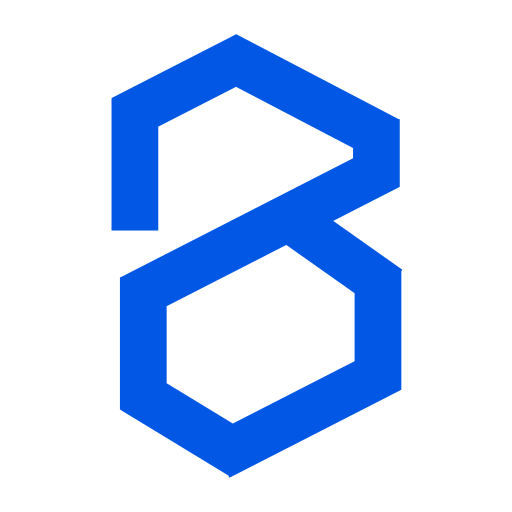
  
</p>

<h1 align="center">Buildev</h1>

<p align="center">
  <strong>The world's first open-source AI-native vector design tool.</strong><br />
  <sub>Concurrent Agent Teams &bull; Design-as-Code &bull; Built-in MCP Server &bull; Multi-model Intelligence</sub>
</p>

<p align="center">
  <a href="./README.md"><b>English</b></a> ·
  <a href="./README.zh.md">简体中文</a> ·
  <a href="./README.zh-TW.md">繁體中文</a> ·
  <a href="./README.ja.md">日本語</a> ·
  <a href="./README.ko.md">한국어</a> ·
  <a href="./README.fr.md">Français</a> ·
  <a href="./README.es.md">Español</a> ·
  <a href="./README.de.md">Deutsch</a> ·
  <a href="./README.pt.md">Português</a> ·
  <a href="./README.ru.md">Русский</a> ·
  <a href="./README.hi.md">हिन्दी</a> ·
  <a href="./README.tr.md">Türkçe</a> ·
  <a href="./README.th.md">ไทย</a> ·
  <a href="./README.vi.md">Tiếng Việt</a> ·
  <a href="./README.id.md">Bahasa Indonesia</a>
</p>

<p align="center">
  
</p>

<p align="center">
  <a href="https://github.com/bryfar/Buildev-oficial/stargazers"></a>
  <a href="https://github.com/bryfar/Buildev-oficial/blob/main/LICENSE"></a>
  <a href="https://github.com/bryfar/Buildev-oficial/actions/workflows/ci.yml"></a>
  <a href="https://discord.gg/h9Fmyy6pVh"></a>
</p>

<br />

---

## Why Buildev

<table>
<tr>
<td width="50%">

### 🎨 Prompt → Canvas

Describe any UI in natural language. Watch it appear on the infinite canvas in real-time with streaming animation. Modify existing designs by selecting elements and chatting.

</td>
<td width="50%">

### 🤖 Concurrent Agent Teams

The orchestrator decomposes complex pages into spatial sub-tasks. Multiple AI agents work on different sections simultaneously — hero, features, footer — all streaming in parallel with per-member canvas indicators.

</td>
</tr>
<tr>
<td width="50%">

### 🧠 Multi-Model Intelligence

Automatically adapts to each model's capabilities. Claude gets full prompts with thinking; GPT-4o/Gemini disable thinking; smaller models (MiniMax, Qwen, Llama) get simplified prompts for reliable output.

</td>
<td width="50%">

### 🔌 MCP Server

One-click install into Claude Code, Codex, Gemini, OpenCode, Kiro, or Copilot CLIs. Design from your terminal — read, create, and modify `.op` files through any MCP-compatible agent.

</td>
</tr>
<tr>
<td width="50%">

### 🎨 Style Guides

Built-in style guide library with tag-based fuzzy matching. Apply visual styles (glassmorphism, brutalist, retro, etc.) to AI-generated designs. MCP tools for external agent access.

</td>
<td width="50%">

### 📦 Design-as-Code

`.op` files are JSON — human-readable, Git-friendly, diffable. Design variables generate CSS custom properties. Code export to React + Tailwind or HTML + CSS.

</td>
</tr>
<tr>
<td width="50%">

### 🖥️ Runs Everywhere

Web app + native desktop on macOS, Windows, and Linux via Electron. Auto-updates from GitHub Releases. `.op` file association — double-click to open.

</td>
<td width="50%">

### ⌨️ CLI — `op`

Control the design tool from your terminal. `op design`, `op insert` — batch design DSL, node manipulation. Pipe in from files or stdin. Works with desktop app or web server.

</td>
</tr>
<tr>
<td width="50%">

### 🎯 Multi-Platform Code Export

Export to React + Tailwind, HTML + CSS, Vue, Svelte, Flutter, SwiftUI, Jetpack Compose, React Native — all from one `.op` file. Design variables become CSS custom properties.

</td>
<td width="50%">

### 🧩 Embeddable SDK

`pen-engine` (headless) + `pen-react` (React UI SDK) — embed the design engine in your own app. DesignProvider, DesignCanvas, hooks, panels, and toolbar components out of the box.

</td>
</tr>
<tr>
<td width="50%">

### ✨ AI Vision Scanner

Drop a screenshot or mockup and convert it into editable PenNode AST nodes instantly. Powered by Claude/GPT-4o vision.

</td>
<td width="50%">

### 🔁 Code Mode Autosync

Edit generated code and sync changes back to the visual canvas bidirectionally. React, Vue, HTML parsers included.

</td>
</tr>
<tr>
<td width="50%">

### 🧩 Plugin System

Extensible plugin architecture with 9 built-in plugins. Hooks for before/after generate, export, import. Custom plugin API.

</td>
<td width="50%">

### 🖥️ Preview Mode

Dedicated device preview for responsive testing. Mobile, Tablet, Desktop simulation with fullscreen and auto-scale.

</td>
</tr>
</table>

---

## Architecture Overview

Buildev is a **Design-as-Code** platform. Unlike traditional design tools that export static images, every design is a living `.op` JSON document that can be version-controlled, AI-generated, and exported to production code.

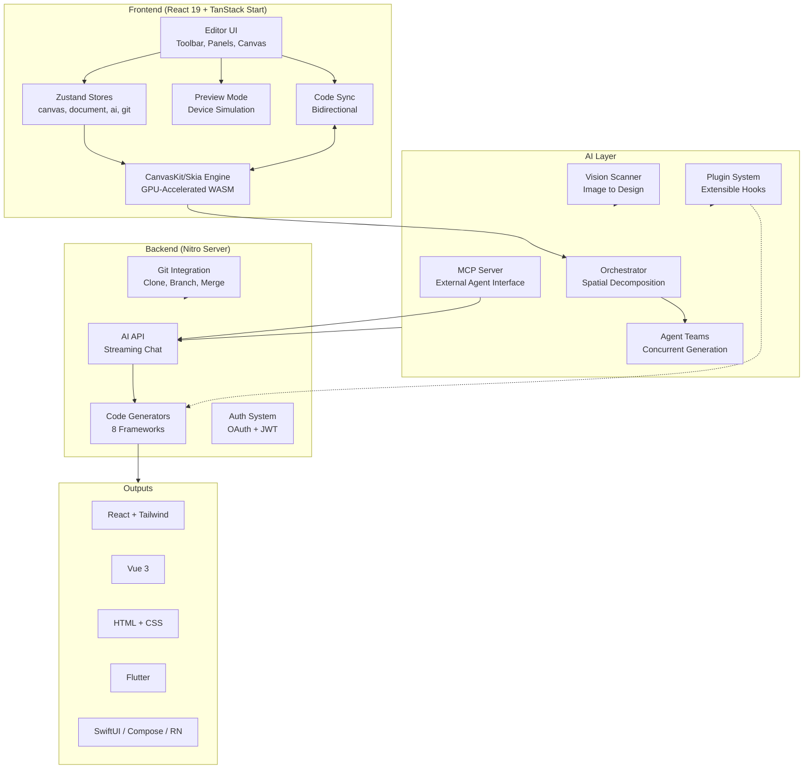

---

## How the IDE Works

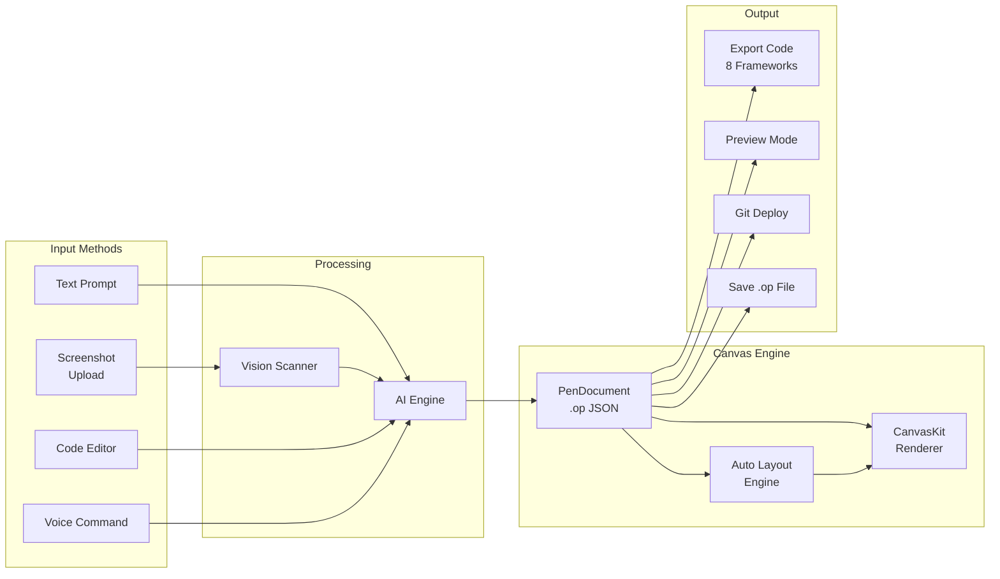

The IDE has three main panels:

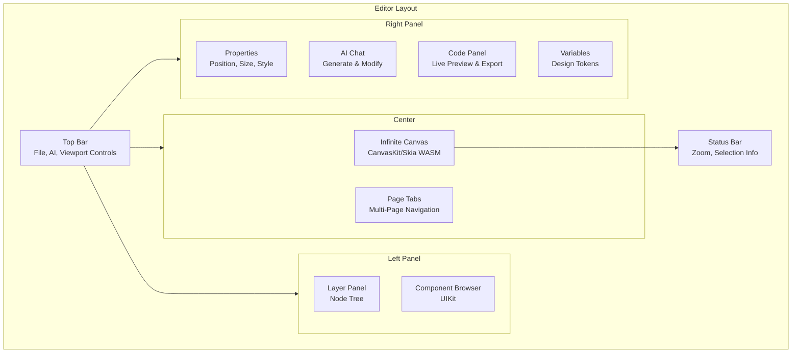

---

## Install

**macOS (Homebrew):**

```bash
brew tap zseven-w/buildev
brew install --cask buildev
```

**Windows (Scoop):**

```powershell
scoop bucket add buildev https://github.com/zseven-w/scoop-buildev
scoop install buildev
```

**Linux / Windows direct download:** [GitHub Releases](https://github.com/bryfar/Buildev-oficial/releases) — `.exe` (Windows), `.AppImage` / `.deb` (Linux)

**CLI (`op`):**

```bash
npm install -g @bryfar/buildev
```

## Quick Start (Development)

```bash
# Install dependencies
bun install

# Start dev server at http://localhost:3000
bun --bun run dev
```

Or run as a desktop app:

```bash
bun run electron:dev
```

> **Prerequisites:** [Bun](https://bun.sh/) >= 1.0 and [Node.js](https://nodejs.org/) >= 18. Optional: [Zig](https://ziglang.org/) >= 0.14 for building `agent-native` from source (a prebuilt binary will be downloaded automatically if Zig is not installed).

### Docker

Multiple image variants are available — pick the one that fits your needs:

| Image | Size | Includes |
|-------|------|----------|
| `buildev:latest` | ~226 MB | Web app only |
| `buildev-claude:latest` | — | + Claude Code CLI |
| `buildev-codex:latest` | — | + Codex CLI |
| `buildev-opencode:latest` | — | + OpenCode CLI |
| `buildev-copilot:latest` | — | + GitHub Copilot CLI |
| `buildev-gemini:latest` | — | + Gemini CLI |
| `buildev-full:latest` | ~1 GB | All CLI tools |

**Run (web only):**

```bash
docker run -d -p 3000:3000 ghcr.io/bryfar/buildev:latest
```

**Run with AI CLI (e.g. Claude Code):**

The AI chat relies on Claude CLI OAuth login. Use a Docker volume to persist the login session:

```bash
# Step 1 — Login (one-time)
docker volume create buildev-claude-auth
docker run -it --rm \
  -v buildev-claude-auth:/root/.claude \
  ghcr.io/bryfar/buildev-claude:latest claude login

# Step 2 — Start
docker run -d -p 3000:3000 \
  -v buildev-claude-auth:/root/.claude \
  ghcr.io/bryfar/buildev-claude:latest
```

**Build locally:**

```bash
# Base (web only)
docker build --target base -t buildev .

# With a specific CLI
docker build --target with-claude -t buildev-claude .

# Full (all CLIs)
docker build --target full -t buildev-full .
```

---

## AI-Native Design

**Prompt to UI**

- **Text-to-design** — describe a page, get it generated on canvas in real-time with SSE streaming animation
- **Orchestrator** — decomposes complex pages into spatial sub-tasks for parallel generation
- **Agent Teams** — concurrent team members with delegate tool, per-member canvas indicators, and fallback strategies
- **Design modification** — select elements, then describe changes in natural language
- **Vision input** — attach screenshots or mockups for reference-based design
- **Style Guides** — apply visual styles (glassmorphism, brutalist, retro, etc.) via tag-based fuzzy matching
- **Anti-slop** — cross-generation diversity tracking to avoid repetitive AI output

**Multi-Agent Support**

| Agent | Setup |
|-------|-------|
| **Built-in (9+ providers)** | Select from provider presets with region switcher — Anthropic, OpenAI, Google, DeepSeek, and more |
| **Claude Code** | No config — uses Claude Agent SDK with local OAuth |
| **Codex CLI** | Connect in Agent Settings (`Cmd+,`) |
| **OpenCode** | Connect in Agent Settings (`Cmd+,`) |
| **GitHub Copilot** | `copilot login` then connect in Agent Settings (`Cmd+,`) |
| **Gemini CLI** | Connect in Agent Settings (`Cmd+,`) |

**Model Capability Profiles** — automatically adapts prompts, thinking mode, and timeouts per model tier. Full-tier models (Claude) get complete prompts; standard-tier (GPT-4o, Gemini, DeepSeek) disable thinking; basic-tier (MiniMax, Qwen, Llama, Mistral) get simplified nested-JSON prompts for maximum reliability.

**i18n** — Full interface localization in 15 languages: English, 简体中文, 繁體中文, 日本語, 한국어, Français, Español, Deutsch, Português, Русский, हिन्दी, Türkçe, ไทย, Tiếng Việt, Bahasa Indonesia.

**MCP Server**

- Built-in MCP server (`pen-mcp` package) — one-click install into Claude Code / Codex / Gemini / OpenCode / Kiro / Copilot CLIs
- Auto-detects Node.js — if not installed, falls back to HTTP transport and auto-starts the MCP HTTP server
- Design automation from terminal: read, create, and modify `.op` files via any MCP-compatible agent
- **Layered design workflow** — `design_skeleton` → `design_content` → `design_refine` for higher-fidelity multi-section designs
- **Segmented prompt retrieval** — load only the design knowledge you need (schema, layout, roles, icons, planning, etc.)
- **Style guide tools** — `get_style_guide_tags` and `get_style_guide` for applying visual styles via MCP
- Multi-page support — create, rename, reorder, and duplicate pages via MCP tools

**Code Generation**

- React + Tailwind CSS, HTML + CSS, CSS Variables
- Vue, Svelte, Flutter, SwiftUI, Jetpack Compose, React Native

---

## Features

### ✨ AI Vision Scanner

Drop a screenshot or mockup and convert it into editable PenNode AST nodes instantly.

```mermaid
flowchart LR
    Upload[Upload<br/>Screenshot/PNG/JPG]
    AI[Vision AI<br/>Claude/GPT-4o]
    Parser[JSON Parser<br/>→ PenNode AST]
    Canvas[Canvas<br/>Editable Design]

    Upload -->|base64 image| AI
    AI -->|structured JSON| Parser
    Parser -->|PenNode[]| Canvas
```

- **File:** `apps/web/src/services/ai/vision-scanner.ts`
- Accepts image data via AI chat attachments
- Returns structured `PenNode[]` with positions, sizes, colors, and text
- Supports context hints for better accuracy

### 🔁 Code Mode Autosync

Edit generated code and sync changes back to the visual canvas bidirectionally.

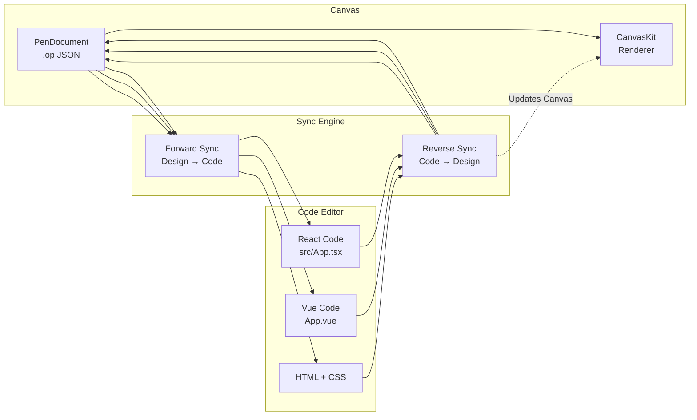

- **Reverse parsers:** React, Vue 3, HTML, generic
- **Sync state:** dirty/clean tracking per file
- **Conflict detection:** warns on simultaneous edits

### 🧩 Plugin System

Extensible plugin architecture built on top of the AI Skills engine.

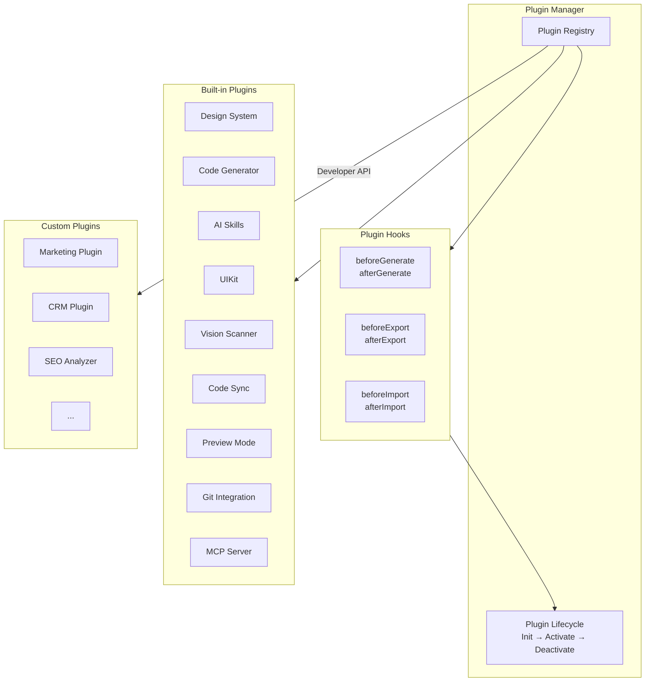

- **9 built-in plugins** pre-installed
- **Phase hooks:** before/after generate, export, import
- **Capability system:** plugins advertise what they offer
- **Store:** `apps/web/src/stores/plugin-store.ts`
- **Engine:** `packages/pen-ai-skills/src/plugin-system.ts`

### 🖥️ Preview Mode

Dedicated device preview for responsive testing.

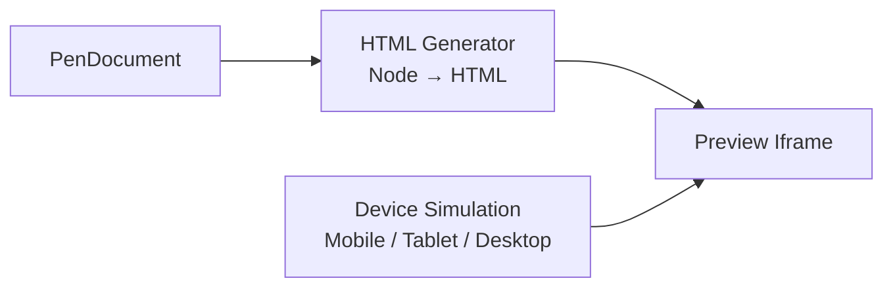

- **Devices:** Mobile (375px), Tablet (768px), Desktop (1280px)
- **Features:** Fullscreen, Auto-scale, Refresh
- **File:** `apps/web/src/components/editor/preview-mode.tsx`

### 🖥️ Runs Everywhere

Web app + native desktop on macOS, Windows, and Linux via Electron. Auto-updates from GitHub Releases.

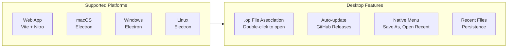

### ⌨️ CLI — `op`

```bash
npm install -g @bryfar/buildev

op start                     # Launch desktop app
op design @landing.txt       # Batch design from file
op insert '{"type":"RECT"}'  # Insert a node
op import:figma design.fig   # Import Figma file
cat design.dsl | op design - # Pipe from stdin
```

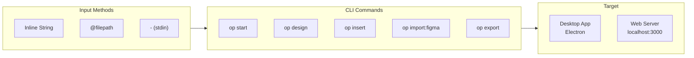

Supports three input methods: inline string, `@filepath` (read from file), or `-` (read from stdin). Works with desktop app or web dev server. See [CLI README](./apps/cli/README.md) for full command reference.

**LLM Skill** — install the Buildev Skill plugin to teach AI agents (Claude Code, Cursor, Codex, Gemini CLI, etc.) how to design with `op`.

### 🎯 Multi-Platform Code Export

8 frameworks from one design:

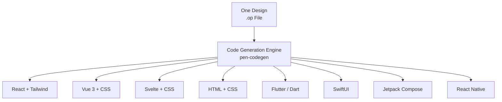

### 🎨 Prompt → Canvas

Describe any UI in natural language. Watch it appear on the infinite canvas in real-time with SSE streaming animation. Modify existing designs by selecting elements and chatting.

```mermaid
flowchart LR
    Prompt[User Prompt<br/>"A landing page for SaaS"]
    AI[AI Engine<br/>Streaming Generation]
    Canvas[Infinite Canvas<br/>Real-time Rendering]
    Edit[Select & Modify<br/>Natural Language]

    Prompt -->|Streaming SSE| AI
    AI -->|Chunk-by-chunk| Canvas
    Canvas -->|Select element| Edit
    Edit -->|"Make it darker"| AI
```

### 🤖 Concurrent Agent Teams

The orchestrator decomposes complex pages into spatial sub-tasks. Multiple AI agents work on different sections simultaneously — hero, features, footer — all streaming in parallel with per-member canvas indicators.

```mermaid
flowchart LR
    User[User Prompt<br/>"Landing page for SaaS"]
    Orchestrator[Orchestrator<br/>Spatial Decomposition]
    
    subgraph Agents["Agent Teams"]
        A1[Agent 1<br/>Hero Section]
        A2[Agent 2<br/>Features Grid]
        A3[Agent 3<br/>Footer]
        A4[Agent N<br/>...]
    end
    
    Canvas[Canvas<br/>Real-time Streaming]

    User --> Orchestrator
    Orchestrator --> A1
    Orchestrator --> A2
    Orchestrator --> A3
    Orchestrator --> A4
    A1 --> Canvas
    A2 --> Canvas
    A3 --> Canvas
    A4 --> Canvas
```

- **Delegate tool** — agents can hand off sub-tasks to specialized peers
- **Per-member canvas indicators** — visual feedback for each agent's progress
- **Fallback strategies** — graceful degradation if an agent times out

### 🧠 Multi-Model Intelligence & Agent Providers

Automatically adapts to each model's capabilities across 9+ providers.

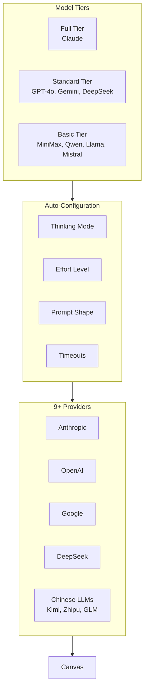

| Agent | Setup |
|-------|-------|
| **Built-in (9+ providers)** | Select from provider presets with region switcher |
| **Claude Code** | No config — uses Claude Agent SDK with local OAuth |
| **Codex CLI** | Connect in Agent Settings (`Cmd+,`) |
| **OpenCode** | Connect in Agent Settings (`Cmd+,`) |
| **GitHub Copilot** | `copilot login` then connect in Agent Settings |
| **Gemini CLI** | Connect in Agent Settings (`Cmd+,`) |

### 🔌 MCP Server

Built-in MCP server for external AI agent integration.

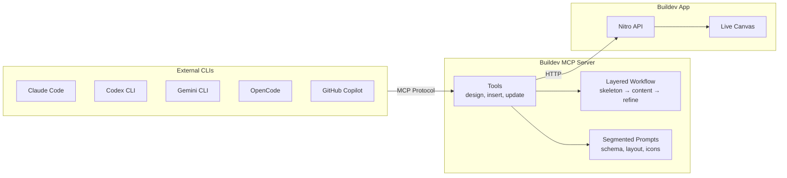

- **One-click install** into any MCP-compatible CLI
- **Layered workflow:** `design_skeleton` → `design_content` → `design_refine`
- **Segmented prompts:** load only what you need (schema, layout, icons, planning)
- **Style guide tools:** `get_style_guide_tags`, `get_style_guide`
- **Multi-page:** create, rename, reorder, duplicate pages via MCP

### 🎨 Style Guides

50+ built-in styles with tag-based fuzzy matching. Apply visual styles to AI-generated designs.

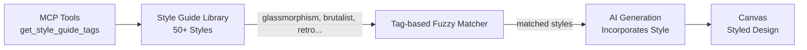

- **Categories:** glassmorphism, brutalist, retro, modern SaaS, luxury, gaming, fintech, health, editorial, and 40+ more
- **MCP tools:** external agents can query and apply style guides

### 📦 Design-as-Code

`.op` files are JSON — human-readable, Git-friendly, diffable.

```mermaid
flowchart LR
    Design[Visual Design]
    OpFile[.op File<br/>JSON Document]
    Git[Git Version Control]
    Code[Code Export<br/>8 Frameworks]
    Variables[CSS Custom Properties<br/>var\(--name\)]

    Design --> OpFile
    OpFile -->|Diffable| Git
    OpFile --> Code
    OpFile --> Variables
```

### 🖥️ Canvas & Drawing

Infinite canvas with GPU-accelerated rendering via CanvasKit/Skia WASM.

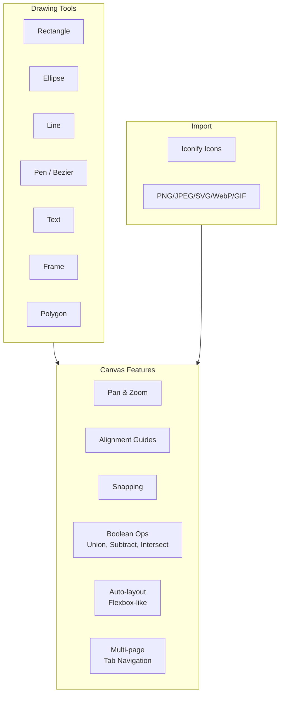

### 🎨 Design System & Variables

Full design token system with multi-theme support.

```mermaid
flowchart TB
    subgraph Tokens["Design Tokens"]
        Colors[Color Variables<br/>$color-1, $color-2]
        Numbers[Number Variables<br/>$spacing-md]
        Strings[String Variables<br/>$font-family]
    end

    subgraph Themes["Multi-Theme"]
        Theme1[Theme Axis 1<br/>Light / Dark]
        Theme2[Theme Axis 2<br/>Compact / Comfortable]
    end

    subgraph Components["Components"]
        Reusable[Reusable Components]
        Instances[Instances & Overrides]
    end

    subgraph Output["Output"]
        CSS[CSS Custom Properties<br/>var\(--name\)]
        UIKit[UIKits<br/>Import/Export .pen]
    end

    Tokens --> Themes
    Themes --> Components
    Components --> Output
```

### 🤖 AI & Agents

- **Prompt-to-canvas** with streaming generation and orchestrator-driven spatial decomposition
- **Concurrent Agent Teams** — multiple designers work in parallel with per-member indicators
- **Layered workflow** — `design_skeleton` → `design_content` → `design_refine` with focused prompts per phase
- **Style Guides** — 50+ built-in styles with tag-based fuzzy matching
- **Multi-model capability profiles** — auto-adapts thinking, effort, prompt shape per model tier
- **Built-in agent runtime** (`agent-native`, Zig NAPI) + Anthropic, Claude Agent SDK, OpenCode, Codex, Copilot, Gemini providers
- **Chinese LLM providers** — Kimi, Zhipu, GLM, DouBao, Ark, Bailian/DashScope, ModelScope, Coding Plans

### 🔗 Git Integration

Full Git version control built into the editor.

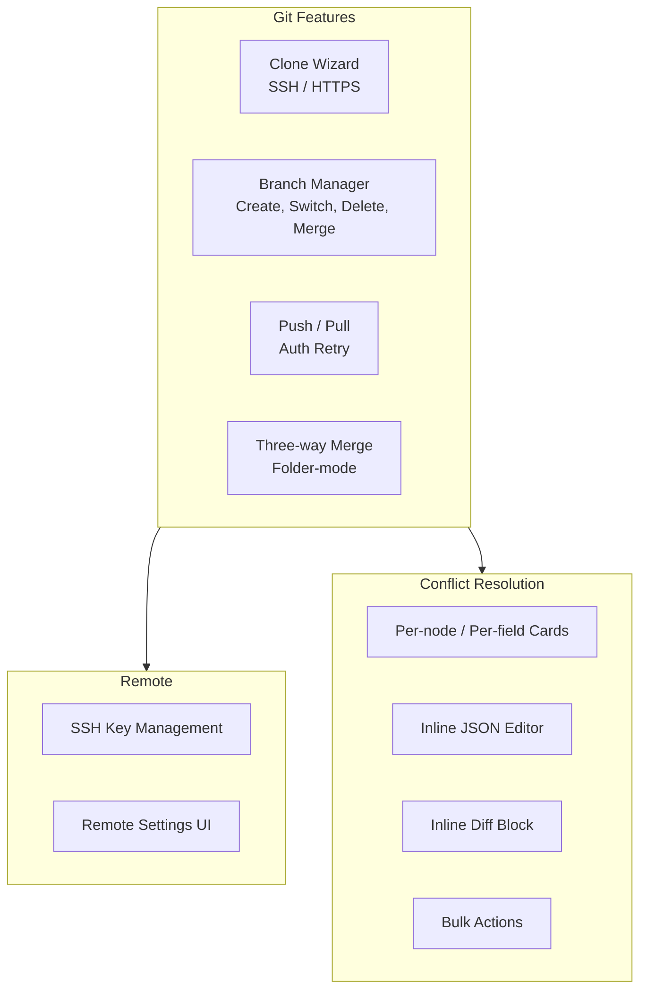

- **Clone wizard** with SSH / HTTPS auth and SSH key management
- **Branch picker** — create, switch, delete, merge
- **Pull / push cascades** with auth retry and non-fast-forward handling
- **Folder-mode three-way merge** with on-disk `MERGE_HEAD` state tracking
- **Conflict panel** with per-node / per-field three-way cards, inline JSON editor, bulk actions, and inline diff block
- **15-locale i18n** across the whole Git surface

### 🗄️ Export

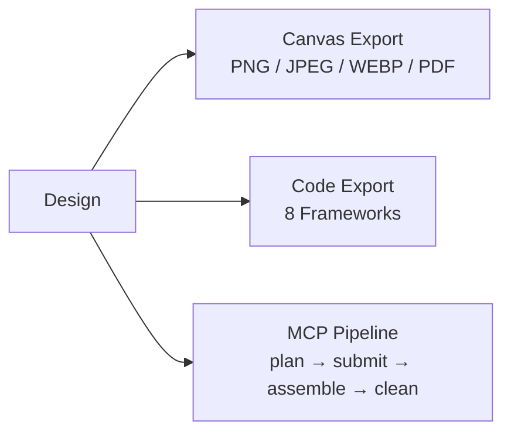

- Canvas export — PNG, JPEG, WEBP, PDF (`Cmd+Shift+P`)
- Code export — React + Tailwind, HTML + CSS, Vue, Svelte, Flutter, SwiftUI, Jetpack Compose, React Native
- Incremental MCP codegen pipeline — `codegen_plan`, `codegen_submit_chunk`, `codegen_assemble`, `codegen_clean`

### 🌀 Figma Import

Import `.fig` files with layout, fills, strokes, effects, text, images, and vectors preserved.

```mermaid
flowchart LR
    Figma[Figma .fig File]
    Parser[Binary Parser<br/>pen-figma]
    Mapper[Node Mapper<br/>Figma → PenNode]
    Canvas[Canvas<br/>Editable Design]

    Figma -->|binary| Parser
    Parser -->|Figma nodes| Mapper
    Mapper -->|PenNode[]| Canvas
```

### 🖥️ Electron Desktop

Native macOS, Windows, and Linux app.

```mermaid
flowchart TB
    subgraph Desktop["Desktop Features"]
        FileAssoc[.op File Association<br/>Double-click to open]
        SingleInstance[Single-instance Lock]
        AutoUpdater[Auto-update<br/>GitHub Releases]
        Menu[Native Application Menu<br/>Save As, Open Recent]
        Recent[Recent Files<br/>Persistence]
        Dialog[Unsaved Changes Dialog<br/>On Close]
    end

    subgraph Tech["Under the Hood"]
        Electron[Electron 35]
        Nitro[Nitro Server Fork]
        IPC[IPC Handlers<br/>File Dialogs, Theme, Prefs]
    end

    Tech --> Desktop
```

### 🎯 Editor Modes

Switch between **Design Mode** and **IDE Mode** for different workflows.

```mermaid
flowchart TB
    subgraph Editor["Editor"]
        TopBar[Top Bar<br/>Mode Selector]
    end

    subgraph DesignMode["🎨 Design Mode"]
        Canvas[Canvas Editor<br/>CanvasKit/Skia]
        Layers[Layer Panel]
        Properties[Properties Panel]
        AI[AI Chat Panel]
        Toolbar[Drawing Tools]
    end

    subgraph IDEMode["💻 IDE Mode"]
        Explorer[Explorer Panel<br/>Virtual File Tree]
        CodeEditor[Code Editor<br/>Monaco]
        BottomPanel[Bottom Panel<br/>Problems / Output / Terminal]
        StackAssistant[Stack Migration<br/>Assistant]
    end

    TopBar -->|Toggle| DesignMode
    TopBar -->|Toggle| IDEMode
```

- **Design Mode** — Full visual canvas with drawing tools, layer panel, properties, AI chat
- **IDE Mode** — Split-panel code editor with virtual file tree, Monaco editor, diagnostics, stack migration assistant (React/Vue/Astro)
- **Preview** — HTML preview in new tab from the top bar
- **Code Sync** — Bidirectional sync between code and canvas when editing generated files

### 🗂️ Project Dashboard

A full dashboard system for managing projects, workspaces, and drafts.

```mermaid
flowchart TB
    subgraph Dashboard["Dashboard (/)"]
        Nav[Sidebar Navigation]
        Grid[Project Grid]
    end

    subgraph Routes["Dashboard Routes"]
        Home[Home<br/>Recent & Local Projects]
        Workspaces["/workspaces<br/>Workspace List"]
        Workspace["/workspaces/:id<br/>Workspace Detail"]
        Drafts["/drafts<br/>Unassigned Projects"]
        Recents["/recents<br/>All Recent Files"]
        Library["/library<br/>Component Library"]
    end

    subgraph NavItems["Navigation"]
        Main[Main Section<br/>Projects, Workspaces, Drafts, Recents]
        Lib[Library Section<br/>Browse Components]
    end

    Dashboard --> Routes
    Nav --> NavItems
```

- **Home (`/`)** — Recent projects, local project grid, cloud projects
- **Workspaces (`/workspaces`)** — List all workspaces, create/rename/delete
- **Workspace Detail (`/workspaces/:id`)** — View workspace projects, create new, move drafts
- **Drafts (`/drafts`)** — Unassigned projects not yet in any workspace
- **Recents (`/recents`)** — All recently opened files
- **Library (`/library`)** — Component library browser

### 🏗️ New Project Wizard

Create projects with a 3-step wizard supporting multiple creation methods.

```mermaid
flowchart LR
    subgraph Step1["Step 1: Architect"]
        AI[AI Assistant<br/>Prompt-based]
        Figma[Figma Import<br/>Upload .fig]
        Reverse[Reverse UI<br/>Image to Design]
        Import[Import<br/>Git / JSON]
        Blank[Start Blank]
    end

    subgraph Step2["Step 2: Configure"]
        Name[Project Name]
        Type[Project Type<br/>landing / multisite / cms]
        Stack[Frontend Stack<br/>React / Vue / Astro]
        Backend[Backend<br/>Static / Node / Serverless]
        CMS[CMS Provider<br/>Optional]
    end

    subgraph Step3["Step 3: Review"]
        Summary[Review Summary]
        Create[Create Project]
    end

    Step1 --> Step2 --> Step3
```

- **Step 1 — Architect:** Choose how to create: AI Assistant, Figma import, Reverse UI (from image), Import from Git/JSON, or Start blank
- **Step 2 — Configure:** Set project name, type (landing/multisite/cms), frontend stack (React/Vue/Astro), backend (static/Node/serverless/edge), CMS provider
- **Step 3 — Review:** Summary of all choices before creating

### 🏷️ Project Types

Each project has a type that determines its template and dashboard mode.

| Type | Description | Default Pages | Stack |
|------|-------------|---------------|-------|
| **landing** | Single-page landing site | Home | Any |
| **multisite** | Multi-page website | Home, About, Contact | Any |
| **cms** | Content-managed site | Home, Blog, Article | Astro (forced) |

```mermaid
flowchart TB
    subgraph Types["Project Types"]
        Landing[Landing<br/>Single Page]
        Multisite[Multisite<br/>Multi-page]
        CMS[CMS<br/>Content Managed]
    end

    subgraph Config["Auto-Configuration"]
        Pages[Page Structure]
        Stack[Stack Selection]
        Backend[Backend Setup]
    end

    Types --> Config
    Config --> Template[Template & Dashboard Ready]
```

- **Landing:** Single-page, any stack, lightweight setup
- **Multisite:** Multi-page with Home/About/Contact, flexible stack
- **CMS:** Forces Astro stack, includes Content/Manage/Admin sidebar navigation, provider options

### 📰 CMS Sidebar

CMS projects include a dedicated sidebar for content management.

```mermaid
flowchart LR
    subgraph CMS["CMS Sidebar"]
        Content[Content<br/>Pages, Posts, Media]
        Manage[Manage<br/>Settings, Users]
        Admin[Admin<br/>Analytics, Deploy]
    end

    subgraph Providers["CMS Providers"]
        Directus[Directus]
        Strapi[Strapi]
        Payload[Payload CMS]
    end

    Providers --> CMS
    CMS --> Editor[Editor Canvas]
```

- **Content panel:** Pages, Posts, Media management
- **Manage panel:** Settings, Users, Roles
- **Admin panel:** Analytics, Deployment, Webhooks
- **Provider options:** Directus, Strapi, Payload CMS

### 🏢 Workspaces

Organize projects into workspaces for better management.

```mermaid
flowchart TB
    subgraph Workspace["Workspace Features"]
        Create[Create Workspace]
        Rename[Rename Workspace]
        Delete[Delete Workspace]
        Assign[Assign / Unassign Projects]
    end

    subgraph Views["Views"]
        List[Workspaces List]
        Detail[Workspace Detail<br/>Project Grid]
    end

    Workspace --> List
    Workspace --> Detail
    Detail --> Editor[Open in Editor]
```

- **Create/rename/delete** workspaces
- **Assign projects** to workspaces from drafts
- **Move projects** between workspaces
- **LocalStorage persistence** for workspace registry

### 🧩 Embeddable SDK

`pen-engine` (headless) + `pen-react` (React UI SDK) — embed the design engine in your own app.

```mermaid
flowchart TB
    subgraph SDK["Buildev SDK"]
        Engine[pen-engine<br/>Headless Design Engine]
        ReactSDK[pen-react<br/>React UI SDK]
    end

    subgraph ReactComponents["React Components"]
        Provider[DesignProvider]
        Canvas[DesignCanvas]
        Hooks[useDesignEngine<br/>useDocument<br/>useActiveNode]
        Panels[PropertyPanel<br/>LayerPanel<br/>Toolbar]
    end

    Engine --> ReactSDK
    ReactSDK --> Provider
    ReactSDK --> Canvas
    ReactSDK --> Hooks
    ReactSDK --> Panels
```

### 🔐 Auth System

Built-in authentication with OAuth + JWT.

```mermaid
flowchart LR
    subgraph Providers["Auth Providers"]
        GitHub[GitHub OAuth]
        Google[Google OAuth]
    end

    subgraph Auth["Auth Layer"]
        JWT[JWT Tokens]
        Session[Session Management]
        Middleware[Route Protection]
    end

    subgraph Features["Features"]
        Login[Login / Register]
        Profile[User Profile]
        Permissions[Project Permissions]
    end

    Providers --> Auth
    Auth --> Features
```

### 👥 Multiplayer Collaboration

Real-time presence and collaboration.

```mermaid
flowchart LR
    subgraph Multiplayer["Multiplayer Features"]
        Cursors[Remote Cursors]
        Presence[User Presence<br/>Who's online]
        Sync[Real-time Sync<br/>Y.js]
    end

    subgraph UI["UI Indicators"]
        Avatars[User Avatars]
        Count[Online Count]
        Color[Color-coded Cursors]
    end

    Multiplayer --> UI
```

- **Remote cursors** with user-specific colors
- **Presence avatar stack** showing who's online
- **Real-time document sync** via WebSocket

---

## Tech Stack

| | |
|---|---|
| **Frontend** | React 19 · TanStack Start · Tailwind CSS v4 · shadcn/ui · i18next |
| **Canvas** | CanvasKit/Skia (WASM, GPU-accelerated) |
| **Engine** | pen-engine (headless) · pen-react (React UI SDK) |
| **State** | Zustand v5 |
| **Server** | Nitro |
| **Desktop** | Electron 35 |
| **CLI** | `op` — terminal control, batch design DSL |
| **AI** | agent-native (Zig NAPI) · Anthropic SDK · Claude Agent SDK · OpenCode SDK · Copilot SDK |
| **Runtime** | Bun · Vite 7 |
| **Lint** | oxlint · oxfmt |
| **File format** | `.op` — JSON-based, human-readable, Git-friendly |

---

## Project Structure

```text
buildev/
├── apps/
│   ├── web/                    TanStack Start web app
│   │   ├── src/
│   │   │   ├── canvas/         CanvasKit/Skia engine
│   │   │   ├── components/     React UI — editor, panels, dialogs
│   │   │   ├── services/
│   │   │   │   ├── ai/         AI chat, orchestrator, vision scanner
│   │   │   │   ├── codegen/    Code generation wrappers
│   │   │   │   ├── code-parsers/  React/Vue/HTML parsers (reverse sync)
│   │   │   │   └── ide/        IDE workspace services
│   │   │   ├── stores/         Zustand — canvas, document, plugin, code-sync
│   │   │   ├── project-flow/   Dashboard, onboarding, project types
│   │   │   ├── uikit/          Reusable component kit system
│   │   │   ├── hooks/          Keyboard shortcuts, file drop, MCP sync
│   │   │   └── i18n/           15 locales
│   │   └── server/
│   │       ├── api/ai/         Nitro API — streaming chat, vision
│   │       ├── api/auth/       OAuth + JWT authentication
│   │       └── api/mcp/        MCP HTTP transport endpoints
│   ├── desktop/                Electron desktop app
│   └── cli/                    CLI tool — `op` command
├── packages/
│   ├── pen-types/              Type definitions
│   ├── pen-core/               Document tree ops, layout engine
│   ├── pen-engine/             Headless design engine
│   ├── pen-react/              React UI SDK
│   ├── pen-codegen/            8 code generators
│   ├── pen-figma/              Figma .fig parser
│   ├── pen-renderer/           Standalone CanvasKit/Skia renderer
│   ├── pen-mcp/                MCP server
│   ├── pen-sdk/                Umbrella SDK
│   ├── pen-ai-skills/          AI prompt skill engine + Plugin System
│   └── agent-native/           Native AI agent runtime (Zig NAPI)
├── scripts/                    Build and publish scripts
└── .githooks/                  Pre-commit version sync
```

---

## Keyboard Shortcuts

| Key | Action | | Key | Action |
|-----|--------|---|-----|--------|
| `V` | Select | | `Cmd+S` | Save |
| `R` | Rectangle | | `Cmd+Z` | Undo |
| `O` | Ellipse | | `Cmd+Shift+Z` | Redo |
| `L` | Line | | `Cmd+C/X/V/D` | Copy/Cut/Paste/Duplicate |
| `T` | Text | | `Cmd+G` | Group |
| `F` | Frame | | `Cmd+Shift+G` | Ungroup |
| `P` | Pen tool | | `Cmd+Shift+P` | Export (PNG/JPG/WEBP/PDF) |
| `H` | Hand (pan) | | `Cmd+Shift+C` | Code panel |
| `Del` | Delete | | `Cmd+Shift+V` | Variables panel |
| `[ / ]` | Reorder | | `Cmd+J` | AI chat |
| Arrows | Nudge 1px | | `Cmd+,` | Agent settings |
| `Cmd+Alt+U` | Boolean union | | `Cmd+Alt+S` | Boolean subtract |
| `Cmd+Alt+I` | Boolean intersect | | `Cmd+Shift+S` | Save As |

---

## Scripts

```bash
bun --bun run dev          # Dev server (port 3000)
bun --bun run build        # Production build
bun --bun run test         # Run tests (Vitest)
npx tsc --noEmit           # Type check
bun run lint               # Lint (oxlint)
bun run format             # Format (oxfmt)
bun run bump <version>     # Sync version across all package.json
bun run electron:dev       # Electron dev
bun run electron:build     # Electron package
bun run cli:dev            # Run CLI from source
bun run cli:compile        # Compile CLI to dist
bun run mcp:dev            # Run MCP server from source
```

---

## Contributing

Contributions are welcome! See [CLAUDE.md](./CLAUDE.md) for architecture details and code style.

1. Fork and clone
2. Set up version sync: `git config core.hooksPath .githooks`
3. Create a branch: `git checkout -b feat/my-feature`
4. Run checks: `npx tsc --noEmit && bun --bun run test`
5. Commit with [Conventional Commits](https://www.conventionalcommits.org/): `feat(canvas): add rotation snapping`
6. Open a PR against `main`

---

## Roadmap

- [x] Design variables & tokens with CSS sync
- [x] Component system (instances & overrides)
- [x] AI design generation with orchestrator
- [x] MCP server integration with layered design workflow
- [x] Multi-page support
- [x] Figma `.fig` import
- [x] Boolean operations (union, subtract, intersect)
- [x] Multi-model capability profiles
- [x] Monorepo restructure with reusable packages
- [x] CLI tool (`op`) for terminal control
- [x] Built-in AI agent SDK with multi-provider support
- [x] i18n — 15 languages
- [x] Headless design engine (`pen-engine`) + React UI SDK (`pen-react`)
- [x] Style Guides with tag-based matching and MCP tools
- [x] Concurrent Agent Teams with delegate tool and canvas indicators
- [x] Native agent runtime (`agent-native` — Zig NAPI)
- [x] Git integration — clone, branch, push/pull, folder-mode three-way merge
- [x] Canvas raster export (PNG / JPEG / WEBP / PDF)
- [x] AI Vision Scanner — image to design
- [x] Code Mode Autosync — bidirectional code sync
- [x] Preview Mode — responsive device testing
- [x] Plugin System — extensible hooks
- [ ] Collaborative editing
- [ ] Plugin marketplace

---

## Contributors

<a href="https://github.com/bryfar/Buildev-oficial/graphs/contributors">
  
</a>

## License

[MIT](./LICENSE) — Copyright (c) 2026 bryfar

---

<p align="center">
  <strong>Built with ❤️ by the Buildev Team</strong>
</p>
